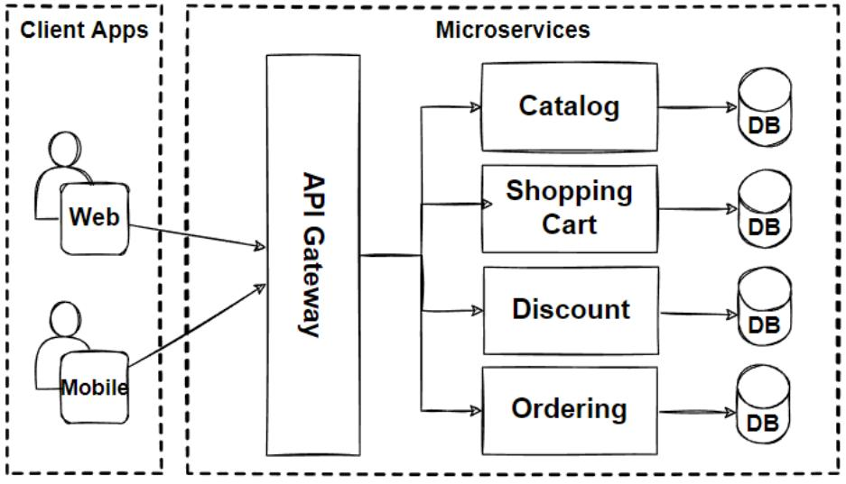

# High-Level Design

## System: E-Commerce Platform

---

## Architecture Overview

The system is designed as a **microservices architecture**. Each service is independently deployable, horizontally scalable, and owns its own database (database-per-service pattern). Services communicate via synchronous REST/gRPC for real-time flows and asynchronous Kafka events for order processing, notifications, and inventory updates.

---

## Architecture Diagram

```
┌─────────────────────────────────────────────────────────────────────────┐
│                            CLIENT LAYER                                 │
│          Web Browser              Mobile App (iOS / Android)            │
└───────────────────────────────────┬─────────────────────────────────────┘
                                    │ HTTPS
                                    ▼
┌───────────────────────────────────────────────────────────────────────┐
│                         CDN + WAF (Cloudflare)                        │
│             Static assets · DDoS protection · Bot filtering           │
└───────────────────────────────┬───────────────────────────────────────┘
                                │
                                ▼
┌───────────────────────────────────────────────────────────────────────┐
│                          API GATEWAY (Kong)                           │
│         JWT Auth · Rate Limiting · Routing · SSL Termination          │
└──────┬──────────┬──────────┬──────────┬──────────┬────────────────────┘
       │          │          │          │          │
       ▼          ▼          ▼          ▼          ▼
┌──────────┐ ┌──────────┐ ┌──────────┐ ┌──────────┐ ┌──────────────┐
│  User    │ │ Product  │ │  Order   │ │ Payment  │ │  Search      │
│ Service  │ │ Service  │ │ Service  │ │ Service  │ │  Service     │
└────┬─────┘ └────┬─────┘ └────┬─────┘ └────┬─────┘ └──────┬───────┘
     │            │            │            │              │
     ▼            ▼            ▼            ▼              ▼
┌──────────┐ ┌──────────┐ ┌──────────┐ ┌──────────┐ ┌──────────────┐
│ User DB  │ │Product DB│ │ Order DB │ │Payment DB│ │Elasticsearch │
│(Postgres)│ │(Postgres)│ │(Postgres)│ │(Postgres)│ │   Index      │
└──────────┘ └──────────┘ └──────────┘ └──────────┘ └──────────────┘
                                │
                                ▼
                   ┌─────────────────────┐
                   │   Apache Kafka      │
                   │  (Event Streaming)  │
                   └──────┬──────┬───────┘
                          │      │
               ┌──────────┘      └──────────────┐
               ▼                                ▼
   ┌──────────────────┐             ┌──────────────────────┐
   │ Notification Svc │             │  Inventory Svc       │
   │ Email·Push·SMS   │             │  Stock decrement     │
   └──────────────────┘             └──────────────────────┘

┌─────────────────────────────────────────────────────────┐
│                    CACHING LAYER                        │
│   Redis Cluster — Session · Cart · Stock · Rate limits  │
└─────────────────────────────────────────────────────────┘

┌─────────────────────────────────────────────────────────┐
│               MONITORING & OBSERVABILITY                │
│       Prometheus + Grafana · ELK Stack · Jaeger         │
└─────────────────────────────────────────────────────────┘
```

---

## Components

### 1. Client Layer
- **Web Browser** and **Mobile Apps** (iOS/Android) communicate with the backend over HTTPS.
- All requests are routed through the CDN before reaching backend services.

### 2. CDN + WAF (Cloudflare)
- Serves static assets (images, JS, CSS) from edge nodes globally.
- Provides DDoS protection, bot scoring, and IP-based blocking.
- Reduces load on origin servers by caching product images and catalog pages.

### 3. API Gateway (Kong)
- Single entry point for all client requests.
- Handles JWT authentication, rate limiting (100 req/min per IP), request routing, and SSL termination.
- Enables plugin-based extensibility (logging, tracing, circuit breaking).

### 4. Core Microservices

| Service | Responsibility | Database |
|---|---|---|
| **User Service** | Registration, login, profile, address management | PostgreSQL |
| **Product Service** | Catalog, variants, images, seller management | PostgreSQL + S3 (images) |
| **Order Service** | Order lifecycle: placement, confirmation, tracking, cancellation | PostgreSQL |
| **Payment Service** | Payment processing, refunds, invoice generation | PostgreSQL |
| **Search Service** | Full-text product search, autocomplete, relevance ranking | Elasticsearch |
| **Notification Service** | Email, push, SMS dispatch via Kafka events | Stateless (uses SES/FCM) |
| **Inventory Service** | Stock management, atomic decrement, low stock alerts | PostgreSQL + Redis |
| **Recommendation Service** | Personalized product recommendations | Redis + ML model store |

### 5. Caching Layer (Redis Cluster)
- **Product catalog cache** — frequently accessed product metadata (TTL: 5 min, cache-aside).
- **Cart data** — user cart stored in Redis for sub-millisecond access (TTL: 7 days).
- **Inventory stock** — current stock levels cached for fast read during browse; authoritative decrement goes through Inventory Service.
- **Session tokens** — JWT refresh token store (TTL: 15 min, extended on activity).
- **Rate limit windows** — sliding window counters per IP per minute.

### 6. Message Queue / Event Streaming (Apache Kafka)
- Decouples Order Service from Payment, Notification, and Inventory services.
- Topics: `order.placed`, `order.confirmed`, `order.cancelled`, `payment.success`, `payment.failed`, `inventory.low`.
- Dead Letter Queue (DLQ) captures events that fail processing for retry or manual review.
- Replication factor: 3 for all critical topics.

### 7. Databases
- **PostgreSQL** — primary relational store for transactional data; each service has its own schema.
- **Elasticsearch** — inverted index for full-text product search with filters and facets.
- **Redis** — low-latency caching and ephemeral state.
- **S3 / Object Storage** — product images and invoice PDFs.
- **ClickHouse** — analytical data store for sales reports, revenue dashboards.

### 8. Monitoring and Observability
- **Prometheus + Grafana** — metrics collection and dashboards (orders/sec, error rates, latency percentiles).
- **ELK Stack** — centralized log aggregation and search across all services.
- **Jaeger** — distributed tracing to debug cross-service latency issues.
