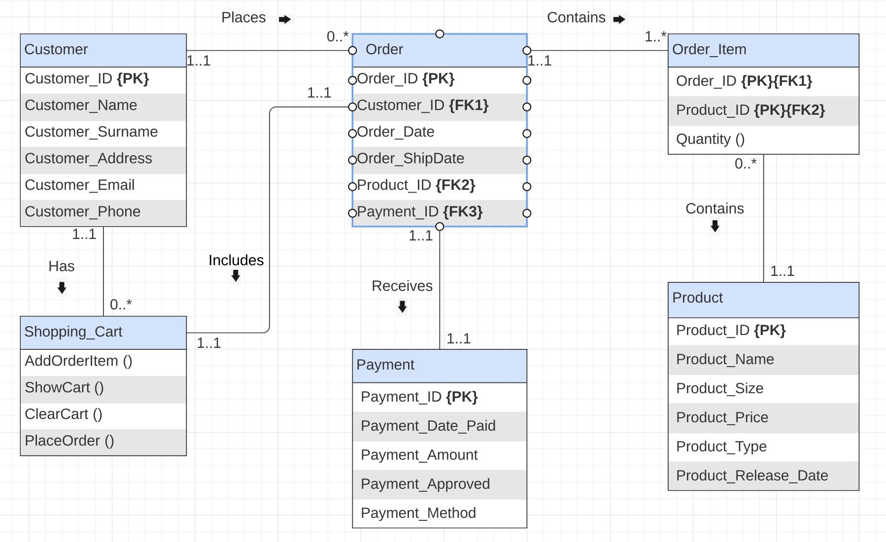

# Low-Level Design

## System: E-Commerce Platform

---

## Database Schema

### 1. Users Table
```sql
CREATE TABLE users (
    user_id       UUID PRIMARY KEY DEFAULT gen_random_uuid(),
    email         VARCHAR(255) UNIQUE NOT NULL,
    password_hash VARCHAR(255),                        -- null for OAuth users
    full_name     VARCHAR(255) NOT NULL,
    phone         VARCHAR(20),
    role          ENUM('customer', 'seller', 'admin') DEFAULT 'customer',
    is_verified   BOOLEAN DEFAULT FALSE,
    created_at    TIMESTAMP DEFAULT NOW(),
    updated_at    TIMESTAMP DEFAULT NOW()
);
```

### 2. Addresses Table
```sql
CREATE TABLE addresses (
    address_id  UUID PRIMARY KEY DEFAULT gen_random_uuid(),
    user_id     UUID NOT NULL REFERENCES users(user_id) ON DELETE CASCADE,
    line1       VARCHAR(255) NOT NULL,
    line2       VARCHAR(255),
    city        VARCHAR(100) NOT NULL,
    state       VARCHAR(100) NOT NULL,
    pincode     VARCHAR(20) NOT NULL,
    country     VARCHAR(100) DEFAULT 'India',
    is_default  BOOLEAN DEFAULT FALSE,
    created_at  TIMESTAMP DEFAULT NOW()
);
```

### 3. Products Table
```sql
CREATE TABLE products (
    product_id   UUID PRIMARY KEY DEFAULT gen_random_uuid(),
    seller_id    UUID NOT NULL REFERENCES users(user_id),
    name         VARCHAR(500) NOT NULL,
    description  TEXT,
    category_id  UUID REFERENCES categories(category_id),
    brand        VARCHAR(255),
    base_price   DECIMAL(10, 2) NOT NULL,
    is_active    BOOLEAN DEFAULT TRUE,
    avg_rating   DECIMAL(3, 2) DEFAULT 0.0,
    total_reviews INTEGER DEFAULT 0,
    created_at   TIMESTAMP DEFAULT NOW(),
    updated_at   TIMESTAMP DEFAULT NOW()
);
```

### 4. Product Variants Table
```sql
CREATE TABLE product_variants (
    variant_id   UUID PRIMARY KEY DEFAULT gen_random_uuid(),
    product_id   UUID NOT NULL REFERENCES products(product_id) ON DELETE CASCADE,
    sku          VARCHAR(100) UNIQUE NOT NULL,
    size         VARCHAR(50),
    color        VARCHAR(50),
    price        DECIMAL(10, 2) NOT NULL,
    stock_qty    INTEGER NOT NULL DEFAULT 0,
    images       TEXT[],                               -- array of S3 URLs
    created_at   TIMESTAMP DEFAULT NOW()
);
```

### 5. Categories Table
```sql
CREATE TABLE categories (
    category_id   UUID PRIMARY KEY DEFAULT gen_random_uuid(),
    name          VARCHAR(255) NOT NULL,
    parent_id     UUID REFERENCES categories(category_id), -- supports nested categories
    slug          VARCHAR(255) UNIQUE NOT NULL,
    created_at    TIMESTAMP DEFAULT NOW()
);
```

### 6. Cart Items Table
```sql
CREATE TABLE cart_items (
    cart_item_id UUID PRIMARY KEY DEFAULT gen_random_uuid(),
    user_id      UUID NOT NULL REFERENCES users(user_id) ON DELETE CASCADE,
    variant_id   UUID NOT NULL REFERENCES product_variants(variant_id),
    quantity     INTEGER NOT NULL CHECK (quantity > 0),
    added_at     TIMESTAMP DEFAULT NOW(),
    UNIQUE (user_id, variant_id)
);
```

### 7. Orders Table
```sql
CREATE TABLE orders (
    order_id         UUID PRIMARY KEY DEFAULT gen_random_uuid(),
    user_id          UUID NOT NULL REFERENCES users(user_id),
    address_id       UUID NOT NULL REFERENCES addresses(address_id),
    status           ENUM('placed', 'confirmed', 'shipped', 'delivered', 'cancelled', 'returned') NOT NULL DEFAULT 'placed',
    total_amount     DECIMAL(10, 2) NOT NULL,
    discount_amount  DECIMAL(10, 2) DEFAULT 0.00,
    final_amount     DECIMAL(10, 2) NOT NULL,
    idempotency_key  VARCHAR(64) UNIQUE NOT NULL,
    placed_at        TIMESTAMP DEFAULT NOW(),
    updated_at       TIMESTAMP DEFAULT NOW()
);
```

### 8. Order Items Table
```sql
CREATE TABLE order_items (
    order_item_id  UUID PRIMARY KEY DEFAULT gen_random_uuid(),
    order_id       UUID NOT NULL REFERENCES orders(order_id) ON DELETE CASCADE,
    variant_id     UUID NOT NULL REFERENCES product_variants(variant_id),
    quantity       INTEGER NOT NULL,
    unit_price     DECIMAL(10, 2) NOT NULL,
    total_price    DECIMAL(10, 2) NOT NULL
);
```

### 9. Payments Table
```sql
CREATE TABLE payments (
    payment_id       UUID PRIMARY KEY DEFAULT gen_random_uuid(),
    order_id         UUID NOT NULL REFERENCES orders(order_id),
    method           ENUM('card', 'upi', 'netbanking', 'wallet') NOT NULL,
    status           ENUM('pending', 'success', 'failed', 'refunded') NOT NULL DEFAULT 'pending',
    gateway_txn_id   VARCHAR(255),                    -- external payment gateway reference
    amount           DECIMAL(10, 2) NOT NULL,
    currency         VARCHAR(10) DEFAULT 'INR',
    created_at       TIMESTAMP DEFAULT NOW(),
    updated_at       TIMESTAMP DEFAULT NOW()
);
```

### 10. Reviews Table
```sql
CREATE TABLE reviews (
    review_id   UUID PRIMARY KEY DEFAULT gen_random_uuid(),
    product_id  UUID NOT NULL REFERENCES products(product_id) ON DELETE CASCADE,
    user_id     UUID NOT NULL REFERENCES users(user_id),
    order_id    UUID NOT NULL REFERENCES orders(order_id), -- ensures verified buyer
    rating      SMALLINT NOT NULL CHECK (rating BETWEEN 1 AND 5),
    title       VARCHAR(255),
    body        TEXT,
    created_at  TIMESTAMP DEFAULT NOW(),
    UNIQUE (product_id, user_id, order_id)             -- one review per purchase
);
```

---

## Entity Relationships

```
users ─────────────────────────────── addresses (1:N)
  │                                      │
  ├── cart_items (1:N) ──── product_variants (N:1)
  │                               │
  ├── orders (1:N) ───────── order_items (1:N)
  │       │                       │
  │   payments (1:1)      product_variants (N:1)
  │       │                       │
  └── reviews (1:N) ──────── products (N:1)
                                  │
                          product_variants (1:N)
                                  │
                          categories (N:1, hierarchical)
```

---

## Class Design / Key Entities

### OrderService (Core Logic)
```
class OrderService:
    placeOrder(userId, cartItems, addressId, idempotencyKey):
        1. Validate idempotency key (Redis lookup)
        2. For each cartItem: check stock via InventoryService.reserveStock(variantId, qty)
        3. Calculate total_amount
        4. Persist Order with status=PLACED in DB
        5. Publish OrderPlaced event to Kafka
        6. Return 202 Accepted with orderId

    confirmOrder(orderId):
        1. Triggered by PaymentSuccess Kafka event
        2. Update order status to CONFIRMED
        3. Publish OrderConfirmed event

    cancelOrder(orderId, userId):
        1. Validate order belongs to user and status is cancellable
        2. Update status to CANCELLED
        3. Call InventoryService.releaseStock() for each item
        4. Trigger refund via PaymentService if already paid
        5. Publish OrderCancelled event
```

### InventoryService (Stock Management)
```
class InventoryService:
    reserveStock(variantId, qty):
        1. DECRBY product:variant:{variantId}:stock qty in Redis (atomic)
        2. If result < 0: INCRBY to rollback, raise OutOfStockException
        3. Write reservation to DB (async via Kafka)
        4. Return success

    releaseStock(variantId, qty):
        1. INCRBY product:variant:{variantId}:stock qty in Redis
        2. Update DB stock_qty (async)
```

### PaymentService
```
class PaymentService:
    initiatePayment(orderId, amount, method, userId):
        1. Create payment record with status=PENDING
        2. Call payment gateway API (Razorpay / Stripe)
        3. On success: publish PaymentSuccess event to Kafka
        4. On failure/timeout: publish PaymentFailed event to Kafka

    processRefund(paymentId):
        1. Look up gateway_txn_id
        2. Call gateway refund API
        3. Update payment status to REFUNDED
```
